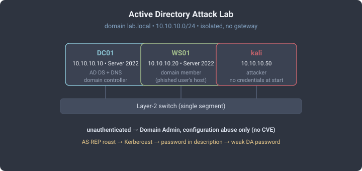

# Active Directory Attack Lab

A three-node Windows domain built to practise the attack path that matters most
in real engagements: **owning a domain without a single software exploit**. Every
step below abuses a *configuration* — a weak service-account password, a
disabled Kerberos pre-auth flag, a password left in a description field — not a
CVE. Nothing here needs the target to be unpatched.

## Topology



- **DC01** — domain controller for `lab.local`, DNS points at itself, no default
  gateway (fully isolated).
- **WS01** — domain-joined member server (the "workstation" a phished user sits on).
- **kali** — the attacker, on the same segment with no domain credentials to start.

Windows 2016 domain/forest functional level, so the defaults are representative
of a lot of production estates.

## The planted misconfigurations

These are the *content* of the lab — the deliberately weak settings an attacker
would hunt for. All the users live in `OU=LabUsers`.

| Object | Weakness | Attack it enables |
|--------|----------|-------------------|
| `svc-sql` (has an SPN, `PasswordNeverExpires`) | Service account with a guessable password and a Service Principal Name | **Kerberoasting** — request a service ticket, crack it offline |
| `jdoe` (`DoesNotRequirePreAuth = True`) | Kerberos pre-authentication disabled | **AS-REP roasting** — get a crackable hash with *no* credentials at all |
| `asmith` (password written in the `description` field) | Secret in a world-readable LDAP attribute | Read it straight out of the directory |
| `backupadm` (member of **Domain Admins**) | A privileged account with a weak password | The final hop to full domain control |

## The attack chain

Four steps, attacker → DC, each independent of the last, none touching a
software vulnerability.

### 1. AS-REP roasting (no credentials needed)

Because `jdoe` has pre-authentication disabled, the KDC will hand out an
AS-REP encrypted with that user's password hash to *anyone* who asks:

```bash
impacket-GetNPUsers lab.local/jdoe -no-pass
# -> $krb5asrep$23$jdoe@LAB.LOCAL:...
hashcat -m 18200 jdoe.hash wordlist.txt
```

This is the scariest one for defenders: it needs nothing but network reach to
the DC.

### 2. Kerberoasting

Any authenticated user can request a service ticket for `svc-sql`; the ticket is
encrypted with the service account's password, so it cracks offline without ever
touching the account:

```bash
impacket-GetUserSPNs lab.local/<user>:<pass> -dc-ip 10.10.10.10 -request
hashcat -m 13100 svc-sql.hash wordlist.txt
```

> **Gotcha that teaches how Kerberos works:** Kerberoasting failed at first with
> `KRB_AP_ERR_SKEW (Clock skew too great)` because the attacker VM's clock was
> hours off and Kerberos only tolerates five minutes. The instructive part:
> **AS-REP roasting (step 1) was unaffected** — the attacker never has to
> authenticate for it — while Kerberoasting broke. Syncing the clock to the DC
> (`net time set -S 10.10.10.10`, since the isolated lab has no internet NTP)
> fixed it. Knowing *which* attacks depend on time is the takeaway.

### 3. Credentials in plain sight

`asmith`'s onboarding password was left in the account description — a real and
common habit. LDAP hands it over on request:

```bash
nxc ldap 10.10.10.10 -u <user> -p <pass> -M get-desc-users
# -> asmith  description: "Initial pw Welcome2023!"
```

### 4. Weak password → Domain Admin

`backupadm` is in Domain Admins with a weak password. Once guessed or sprayed,
it is game over:

```bash
nxc smb 10.10.10.10 -u backupadm -p '<pass>'
# -> (Pwn3d!)
```

## Defensive reading

Every step above maps to a control that costs nothing:

| Attack | The fix |
|--------|---------|
| AS-REP roasting | Don't disable Kerberos pre-auth; alert on accounts that have it disabled |
| Kerberoasting | Long, random, managed service-account passwords (gMSA); monitor TGS requests for RC4 |
| Description-field secrets | Policy + auditing; secrets never live in directory attributes |
| Weak DA password | Tiering, no everyday accounts in Domain Admins, strong-password + lockout policy |

The point of the lab is that a fully patched domain is still wide open if the
configuration is sloppy — which is where most real compromises actually come from.

## How it was built (headless notes)

- The Windows nodes are installed **keyboard-only**: the console has no usable
  mouse pointer, so the entire installer is driven with Tab / arrows / Enter /
  Space, and the domain is seeded by *typing a PowerShell script file into the
  console* character-by-character to avoid multi-layer shell-escaping.
- Once WinRM is enabled the rest is a normal text channel from the hypervisor.
- **Always verify, never assume:** after bulk-seeding the directory, one user
  (`backupadm`) had silently failed to create — the seeding tool dropped a line
  and there was no error. Every planted object has to be checked to actually
  exist, which is exactly the discipline the lab is meant to build.

## Verified end-to-end

All four steps were run from kali against DC01 and confirmed working:
AS-REP hash recovered, service ticket cracked, description password read, and
`backupadm` returning **Pwn3d!** over SMB — a clean unauthenticated-to-Domain-Admin
chain with no exploits involved.
