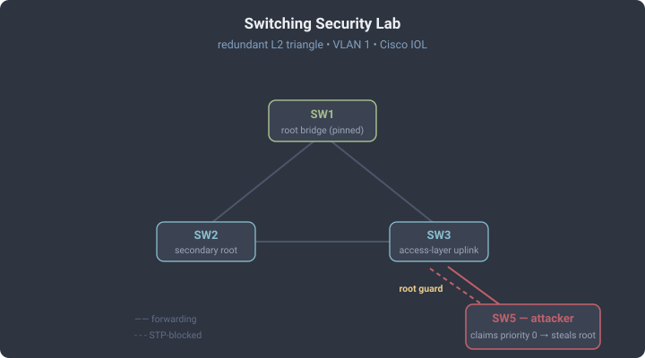

# Switching Security Lab

Five Cisco switches in a redundant Layer-2 topology, built to run the attack
that every flat network is quietly exposed to: **stealing the spanning-tree root
and pulling the whole VLAN's traffic through a switch you control.** Like the AD
lab, this abuses a *default*, not a bug — Spanning Tree Protocol (STP) trusts any
switch that claims to be root, and by default nothing stops one from lying.

Everything below is real output from the lab, captured over the switch consoles.
The switches are Cisco IOL (`i86bi-linux-l2-adventerprisek9-15.1`) running under
nested virtualisation; there is no physical hardware and nothing here touches a
real network.

## Topology



SW1, SW2 and SW3 form a triangle with redundant links, so STP has to block one
path to break the loop. SW5 hangs off SW3 in an access-layer position — the
"switch in a wiring closet" an attacker can reach. All ports are in VLAN 1.

## The misconfiguration: nobody owns the root

STP elects the switch with the lowest bridge ID (priority, then MAC) as root.
Out of the box every switch ships with the same priority (32768), so **the root
is decided by whoever happens to have the lowest MAC address** — an accident, not
a decision. A switch is only the root by luck, and luck is beatable.

The hardened baseline here makes it a decision instead: SW1 is pinned as root
(`spanning-tree vlan 1 priority 24576`), SW2 as backup (28672). That is the
right first step — but on its own it is *not enough*, which is the point.

```
SW1# show spanning-tree vlan 1
  Root ID    Priority    24577
             Address     aabb.cc00.1000
             This bridge is the root
```

## The attack: claim a superior root

An attacker who can reach any switch port sends BPDUs advertising a better
(lower) priority. The lowest possible is 0. From SW5:

```
SW5(config)# spanning-tree vlan 1 priority 0
```

That single command re-elects the whole VLAN. SW5 is now root, and the rest of
the network reorganises around it:

```
SW5# show spanning-tree vlan 1
  Root ID    Priority    1
             Address     aabb.cc00.5000
             This bridge is the root

SW3# show spanning-tree vlan 1          ! SW3's path to root now points AT the attacker
  Root ID    Priority    1
             Address     aabb.cc00.5000
  ...
  Et0/2               Root FWD 100       128.3    P2p     ! root port -> SW5

SW1# show spanning-tree vlan 1          ! the rightful root has been dethroned
  Root ID    Priority    1
             Address     aabb.cc00.5000
             Cost        200
             Port        2 (Ethernet0/1)
```

SW1 — the switch we deliberately pinned as root — now agrees that the attacker
is root. Traffic between segments that used to flow through the core now transits
SW5. The attacker did not break anything; it just asked to be root and everyone
believed it. That reroute is a man-in-the-middle position for every frame that
crosses it. No credentials, no exploit — just an unguarded protocol.

## The defense: root guard

The fix is not "set a lower priority" — the attacker can always go lower. The fix
is to tell the legitimate switches that **root must never live in a certain
direction.** Root guard on the ports facing the access layer blocks any port that
starts receiving superior BPDUs. On SW3, facing SW5:

```
SW3(config)# interface range Ethernet0/2 - 3
SW3(config-if-range)#  spanning-tree guard root

*SPANTREE-2-ROOTGUARD_CONFIG_CHANGE: Root guard enabled on port Ethernet0/2.
*SPANTREE-2-ROOTGUARD_BLOCK: Root guard blocking port Ethernet0/3 on VLAN0001.
```

The moment SW5 advertises a superior BPDU, the guarded ports drop to
*root-inconsistent* — a blocking state that carries data nowhere until the lie
stops:

```
SW3# show spanning-tree inconsistentports
Name                 Interface                Inconsistency
-------------------- ------------------------ ------------------
VLAN0001             Ethernet0/2              Root Inconsistent
VLAN0001             Ethernet0/3              Root Inconsistent

SW1# show spanning-tree vlan 1          ! root restored to the intended switch
  Root ID    Priority    24577
             Address     aabb.cc00.1000
             This bridge is the root
```

The attacker's port is quarantined, SW1 is root again, and the port heals
automatically once the superior BPDUs stop — no manual recovery. Pair it with
**BPDU guard** on true edge ports (where a host, never a switch, should be):
any BPDU there err-disables the port outright.

## What this image can and cannot do

Being honest about the platform matters as much as the result. Tested live on
this IOL image rather than assumed:

| Control | On IOL L2 15.1 | Notes |
|---------|:--------------:|-------|
| STP root election / manipulation | yes | full, real convergence |
| Root guard (`spanning-tree guard root`) | yes | demonstrated above |
| BPDU guard (`spanning-tree bpduguard`) | yes | accepted and shown in config |
| DHCP snooping (`ip dhcp snooping`) | yes | operational per VLAN, trust + option-82 present |
| Dynamic ARP Inspection (`ip arp inspection`) | **no** | `% Invalid input` — command not in this image |

So a DHCP-snooping lab is reproducible here, but a full DAI (ARP-spoofing)
defense is **not** — that needs real hardware or a different image, and it would
be dishonest to write it up as if it ran. Knowing the boundary of your lab is
part of the methodology, the same way the throughput lab's numbers only make
sense relative to each other.

## Defensive reading

| Attack | The fix |
|--------|---------|
| Root hijack via superior BPDU | Root guard on links toward the access layer; pin root priority as defence-in-depth |
| Rogue switch on an edge port | BPDU guard on all access ports — a BPDU there should never happen |
| Unmanaged trunk negotiation (DTP) | Hard-set access ports (`switchport mode access` + `switchport nonegotiate`) |
| ARP spoofing / DHCP rogue | DHCP snooping + Dynamic ARP Inspection (DAI needs capable hardware) |

The theme is the same as the AD lab: a "working" network with every device
patched is still wide open when a trust decision was left at its default. STP
believes whoever speaks with the most authority — so you have to decide, in
advance and in config, which direction authority is allowed to come from.

## How it was built

The switches were driven over their telnet consoles with a small Python helper
(the EVE-NG nodes have no usable GUI), each stage captured from the live device.
The attack and defence were run in sequence on the same running topology, then
the lab was saved in the defended state — SW1 pinned as root, root guard on SW3's
downlinks, SW5 returned to a default priority so the attack can be replayed by
re-issuing the single `priority 0` command.
